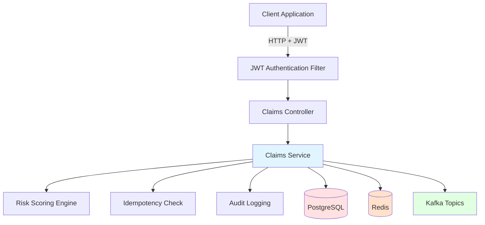

# Insurance Claims Processing Microservice

> Production-grade claims workflow engine mirroring real insurtech operations — built to align directly with Turaco's core claims-paying business.


## Overview

A complete claims management system covering the full lifecycle: submission → validation → risk scoring → approval/rejection. Built with production patterns used by real insurance companies.

## Features

### Core Functionality
- **Full Claims Lifecycle:** Submit, validate, score, approve/reject
- **Role-Based Access Control:** ADMIN, AGENT, CUSTOMER with JWT
- **Event-Driven Architecture:** Kafka events for audit and analytics
- **Idempotent Requests:** Redis prevents duplicate submissions
- **Audit Logging:** Complete trail in PostgreSQL
- **Database Migrations:** Flyway for schema versioning

### Production Ready
- Docker Compose for local development
- GitHub Actions CI/CD pipeline
- Swagger/OpenAPI documentation
- Integration tests with Testcontainers
- Structured logging and metrics

## Tech Stack

- **Framework:** Spring Boot 3.2, Spring Security, Spring Data JPA
- **Database:** PostgreSQL 16 with Flyway migrations
- **Caching:** Redis 7
- **Messaging:** Apache Kafka
- **Auth:** JWT (JSON Web Tokens)
- **Testing:** JUnit 5, Mockito, Testcontainers
- **Docs:** Swagger/OpenAPI
- **DevOps:** Docker, GitHub Actions

## Quick Start

```bash
# Clone repository
git clone https://github.com/Khin-96/insurance-claims-microservice.git
cd insurance-claims-microservice

# Start infrastructure (PostgreSQL, Redis, Kafka)
docker-compose up -d

# Run application
./gradlew bootRun

# Access Swagger UI
open http://localhost:8080/swagger-ui.html
```

## API Endpoints

### Authentication
```http
POST /api/auth/register - Register new user
POST /api/auth/login    - Login and get JWT token
```

### Claims Management
```http
POST   /api/claims              - Submit new claim
GET    /api/claims/{id}         - Get claim details
GET    /api/claims              - List claims (with filters)
PUT    /api/claims/{id}/approve - Approve claim (ADMIN only)
PUT    /api/claims/{id}/reject  - Reject claim (ADMIN only)
GET    /api/claims/stats        - Get claims statistics
```

### Example: Submit Claim
```bash
curl -X POST http://localhost:8080/api/claims \
  -H "Authorization: Bearer ${JWT_TOKEN}" \
  -H "Content-Type: application/json" \
  -H "X-Idempotency-Key: unique-key-123" \
  -d '{
    "policyNumber": "POL-2024-001",
    "claimType": "MEDICAL",
    "amount": 50000.00,
    "description": "Hospital treatment",
    "documents": ["doc1.pdf", "doc2.pdf"]
  }'
```

## Architecture



## Key Technical Decisions

### 1. Idempotent Request Handling

Prevents duplicate claim submissions under concurrent load:

```java
@Service
public class IdempotencyService {
    public boolean isDuplicate(String idempotencyKey) {
        return redisTemplate.hasKey("idempotency:" + idempotencyKey);
    }
    
    public void markProcessed(String idempotencyKey, ClaimResponse response) {
        redisTemplate.opsForValue().set(
            "idempotency:" + idempotencyKey,
            response,
            Duration.ofHours(24)
        );
    }
}
```

### 2. Event-Driven Architecture

Every claim state change triggers Kafka events for audit and analytics:

```java
@Service
public class ClaimEventPublisher {
    public void publishClaimSubmitted(Claim claim) {
        ClaimSubmittedEvent event = new ClaimSubmittedEvent(
            claim.getId(),
            claim.getPolicyNumber(),
            claim.getAmount(),
            Instant.now()
        );
        kafkaTemplate.send("claim-submitted", event);
    }
}
```

### 3. Role-Based Access Control

```java
@PreAuthorize("hasRole('ADMIN')")
public ClaimResponse approveClaim(Long claimId) {
    Claim claim = claimRepository.findById(claimId)
        .orElseThrow(() -> new ClaimNotFoundException(claimId));
    
    claim.setStatus(ClaimStatus.APPROVED);
    claim.setProcessedAt(Instant.now());
    
    claimRepository.save(claim);
    auditService.logApproval(claim, getCurrentUser());
    eventPublisher.publishClaimApproved(claim);
    
    return ClaimResponse.from(claim);
}
```

### 4. Audit Trail

Every action is logged with full context:

```sql
CREATE TABLE audit_log (
    id BIGSERIAL PRIMARY KEY,
    claim_id BIGINT REFERENCES claims(id),
    action VARCHAR(50) NOT NULL,
    performed_by VARCHAR(255) NOT NULL,
    performed_at TIMESTAMP NOT NULL DEFAULT CURRENT_TIMESTAMP,
    old_status VARCHAR(20),
    new_status VARCHAR(20),
    details JSONB
);
```

## Database Schema

```sql
CREATE TABLE claims (
    id BIGSERIAL PRIMARY KEY,
    claim_number VARCHAR(50) UNIQUE NOT NULL,
    policy_number VARCHAR(50) NOT NULL,
    customer_id BIGINT NOT NULL,
    claim_type VARCHAR(50) NOT NULL,
    amount DECIMAL(19,2) NOT NULL,
    description TEXT,
    status VARCHAR(20) NOT NULL DEFAULT 'PENDING',
    risk_score INTEGER,
    submitted_at TIMESTAMP NOT NULL DEFAULT CURRENT_TIMESTAMP,
    processed_at TIMESTAMP,
    created_by VARCHAR(255) NOT NULL,
    updated_at TIMESTAMP NOT NULL DEFAULT CURRENT_TIMESTAMP
);

CREATE INDEX idx_claims_policy ON claims(policy_number);
CREATE INDEX idx_claims_status ON claims(status);
CREATE INDEX idx_claims_customer ON claims(customer_id);
```

## Testing

```bash
# Run all tests
./gradlew test

# Run integration tests with Testcontainers
./gradlew integrationTest

# Generate coverage report
./gradlew jacocoTestReport
```

### Example Integration Test

```java
@SpringBootTest
@Testcontainers
class ClaimSubmissionIntegrationTest {
    
    @Container
    static PostgreSQLContainer<?> postgres = new PostgreSQLContainer<>("postgres:16");
    
    @Test
    void shouldPreventDuplicateClaimSubmission() {
        String idempotencyKey = UUID.randomUUID().toString();
        
        // First submission
        ClaimResponse response1 = submitClaim(idempotencyKey);
        assertThat(response1.getClaimNumber()).isNotNull();
        
        // Duplicate submission with same key
        ClaimResponse response2 = submitClaim(idempotencyKey);
        assertThat(response2.getClaimNumber()).isEqualTo(response1.getClaimNumber());
        
        // Verify only one claim was created
        assertThat(claimRepository.count()).isEqualTo(1);
    }
}
```

## Deployment

### Docker
```bash
# Build image
./gradlew bootBuildImage

# Run container
docker run -p 8080:8080 insurance-claims-microservice:1.0.0
```

### Kubernetes
```bash
kubectl apply -f k8s/
```

## CI/CD Pipeline

GitHub Actions workflow runs on every push:
- ✅ Build and compile
- ✅ Run unit tests
- ✅ Run integration tests
- ✅ Generate coverage report
- ✅ Build Docker image
- ✅ Deploy to staging (on main branch)

## Why This Matters for Turaco

This project demonstrates:

1. **Insurance Domain Knowledge:** Understanding of claims lifecycle
2. **Production Patterns:** Idempotency, audit trails, event sourcing
3. **Security:** JWT authentication, role-based access control
4. **Scalability:** Event-driven architecture, Redis caching
5. **Data Integrity:** Transactions, migrations, audit logging
6. **Testing:** Integration tests with real databases

Built to show I can contribute to Turaco's claims-paying operations from day one.

## Documentation

- [API Documentation](./docs/API.md)
- [Architecture Decisions](./docs/ARCHITECTURE.md)
- [Deployment Guide](./docs/DEPLOYMENT.md)
- [Postman Collection](./postman/claims-api.postman_collection.json)

## License

MIT License - See [LICENSE](LICENSE) file for details

## Contact

Chris Kinga Hinzano  
Email: hinzanno@gmail.com  
GitHub: [@Khin-96](https://github.com/Khin-96)  
Portfolio: [hinzano.dev](https://hinzano.dev)
